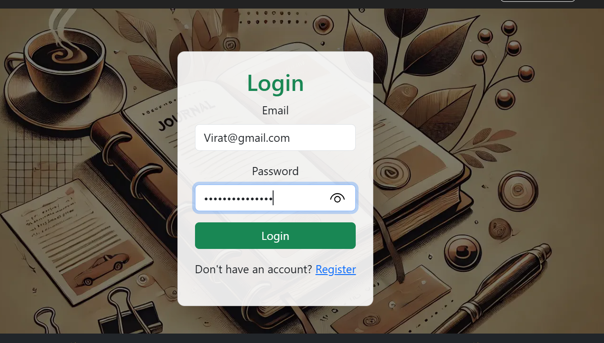
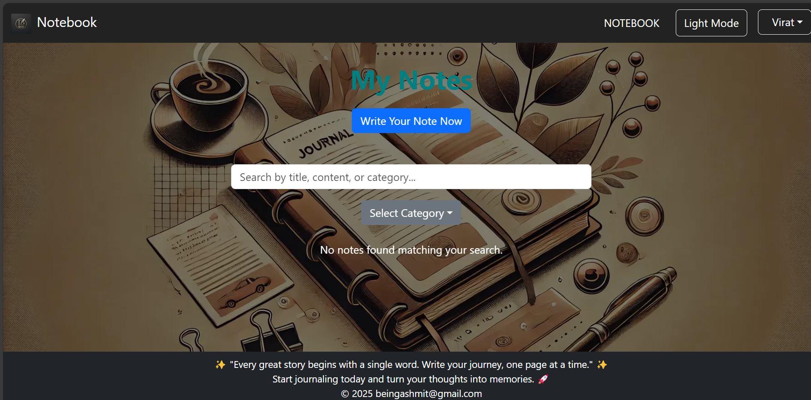

# MERN Notes App - Development Plan

## Overview
This is a full-stack **MERN (MongoDB, Express, React, Node.js) Notes Application** that I have planned to develop in three days, ensuring an efficient workflow with steady progress. This document outlines the complete plan and implementation details.

---

## Project Structure
```
MERN-Notes-App/
│── backend/       # Node.js & Express backend
│   ├── controllers/    # Business logic (Authentication & Notes)
│   │   ├── authController.js
│   │   ├── noteController.js
│   ├── models/         # Database models (Schemas)
│   │   ├── User.js
│   │   ├── Note.js
│   ├── routes/         # API endpoints
│   │   ├── authRoutes.js
│   │   ├── noteRoutes.js
│   ├── middleware/     # JWT authentication middleware
│   │   ├── authMiddleware.js
│   ├── config/         # Configuration files (Database connection)
│   │   ├── db.js
│   ├── .env            # Environment variables
│   ├── server.js       # Main Express server
│   ├── package.json    # Backend dependencies
│
frontend/
│── src/
│   ├── assets/                # Static assets (images, fonts, etc.)
│   │   ├── images/

│
│   ├── components/            # Reusable UI components
│   │   ├── Layout/            # Shared layout components
│   │   │   ├── Header.js
│   │   │   ├── Footer.js
│   │   │   ├── Header.css
│   │   │   ├── Footer.css
│   │   │
│   │   ├── Notes/             # Note-related components
│   │   │   ├── NoteBook.js
│   │   │   ├── NoteBook.css
│   │   │   ├── NoteCard.js
│   │   │   ├── NoteCard.css
│   │   │
│   │   ├── Modals/                # Generic UI components (buttons, modals, etc.)
│   │   │   ├── ViewModal.js
            |__ViewModal.css
│   │   │   ├── CreateNoteModal.js
│   │   │   ├── CreateNoteModal.css
│
│   ├── context/               # Global state management (React Context API)
│   │   ├── AuthContext.js
│   │   ├── ThemeContext.js
│
│   ├── pages/                 # Page-level components 
│   │   ├── Login.js
│   │   ├── Login.css
│   │   ├── Register.js
│   │   ├── Register.css
│
│   ├── utils/                 # Utility/helper functions
│   │   ├── api.js
│
│   ├── App.js                 # Root component
│   ├── index.js               # Entry point
│   ├── package.json           # Project dependencies
│   ├── .gitignore             # Git ignore file
│   ├── README.md              # Project documentation
│

```

---

# Development Plan (Day-wise Breakdown)

## Day 1: Backend Authentication & Frontend Setup (Branch: `day-1`)

### ✅ Backend Tasks
1. Initialize backend project
   ```sh
   mkdir backend && cd backend
   npm init -y
   ```
2. Install required dependencies
   ```sh
   npm install express mongoose dotenv cors bcryptjs jsonwebtoken helmet morgan nodemon
   ```
3. Set up `.env` file for environment variables
4. Create folder structure: `models/`, `routes/`, `controllers/`, `middleware/`, `config/`
5. Implement **MongoDB connection** in `config/db.js`
6. Define **User model (`models/User.js`)** with password hashing
7. Create **Authentication routes (`routes/authRoutes.js`)**
8. Implement **Auth controller (`controllers/authController.js`)** for user registration and login
9. Set up **Express server (`server.js`)** with CORS enabled
10. Run the backend server
    ```sh
    npm run dev
    ```

### ✅ Frontend Tasks
1. Create a **React app**
   ```sh
   npx create-react-app frontend
   cd frontend
   ```
2. Install dependencies
   ```sh
   npm install bootstrap
   ```
3. Configure **Bootstrap CSS**
4. Set up **folder structure**: `components/`, `pages/`, `context/`, `utils/`
5. Implement basic **React Router setup (`App.js`)**
6. Push **Day 1** changes to GitHub
   ```sh
   git checkout -b day-1
   git add .
   git commit -m "Day 1: Backend authentication & frontend setup"
   git push origin day-1
   ```

---


## Day 2: Notes CRUD API & Authentication Middleware (Branch: `day-2`)

### ✅ Backend Tasks
1. Define **Note model (`models/Note.js`)**
2. Create **CRUD routes (`routes/noteRoutes.js`)**
3. Implement **authentication middleware (`middleware/authMiddleware.js`)**
4. Implement **Notes controller (`controllers/noteController.js`)**
5. Secure all **protected routes** using authentication middleware
6. Test APIs using **Postman**
7. Push changes to GitHub
   ```sh
   git checkout -b day-2
   git add .
   git commit -m "Day 2: Implement Notes CRUD API & authentication middleware"
   git push origin day-2
   ```

### ✅ Frontend Tasks
1. Implement **authentication context (`context/AuthContext.js`)**
2. Create **Login & Registration components**
3. Set up **Protected Route component**
4. Push changes to GitHub
   ```sh
   git add .
   git commit -m "Day 2: Authentication logic & context setup"
   git push origin day-2
   ```

---
## Day 3: Frontend Notes CRUD & Profile Page (Branch: day-3)
✅ Frontend Tasks
Integrate Notes CRUD UI

Display Notes:
1 Implement a grid view in the NoteBook component to display all notes using fixed-height Note Cards.
Note Modals:
Use NoteModal for creating and editing notes.
Use ViewNoteModal to display the full content of a note when a card is clicked.
UI Enhancements:
Ensure a clean and responsive layout with proper alignment of Note Cards.
Implement Profile Page

Create Profile Component:
Develop a Profile.js page where users can update their username and email.
Integrate with Auth Context:
Use the authentication context (AuthContext) to fetch and update user details.
API Integration:
Connect the profile update functionality to the backend API.
Update Routing

Add a new route for the Profile page in your main router (e.g., in App.js).
Ensure protected routes (like the Profile page) are only accessible to authenticated users.
Push Changes to GitHub


git checkout -b day-3
git add .
git commit -m "Day 3: Implement Notes CRUD UI & Profile page"
git push origin day-3
 # Git Workflow

1. Initialize Git and **create remote repository**
   ```sh
   git init
   git remote add origin <repo-url>
   ```
2. Create feature branches for each day
   ```sh
   git checkout -b day-1
   git push origin day-1
   git checkout -b day-2
   git push origin day-2
   git checkout -b day-3
   git push origin day-3
   ```
3. Commit and push daily progress
   ```sh
   git add .
   git commit -m "Day X: Description of work done"
   git push origin day-X
   ```
--


   
# Final Submission

- **GitHub Repository:** :-https://github.com/Ashmit-1131/MERN_Notes_App.git
- **Live App:** [Live App URL]

---

## Conclusion

This structured approach ensures that the project is developed in an **organized and efficient manner**. By following this three-day plan, the MERN Notes App will be fully functional with:
✅ **User Authentication** (JWT-based login/signup)
✅ **Notes CRUD Operations** (Create, Read, Update, Delete)
✅ **Protected Routes** (Authentication middleware)
✅ **Responsive UI with Tailwind CSS**
✅ **Full API Integration**


Steps to Run the Application in your local machine (Frontend + Backend):-
1. Clone the project using the following command:

git clone_- https://github.com/Ashmit-1131/MERN_Notes_App.git
cd Mern_notes_App

 project contains two folders:

frontend/ (React application)
backend/ (Node.js/Express API)

2. Running the Backend (Node.js & Express)
cd backend
npm install


3. Set up environment variables:

Create a .env file in the backend/ folder.
Ensure necessary configurations like MONGO_URI,PORT and JWT_SECRET secret keys are added.

npm start

3. Running the Frontend (React)
cd frontend
npm install

4. Update the API URL in utils/api.js:
Since the backend is currently set to a deployed link, update the API base URL in utils/api.js to use localhost:8081 instead
export const config = {
    endpoint:`http://localhost:8081`
  };
  

5. npm start


Steps to Check Application Functionality:-

Landing page:-


firstly you have to register yourself so click on button register it will open 
register page where you can register yourself using name,email and password:-


and once the register is successfully it will redirect you to the login page where you can login using email and password 

once the login successful it will redirect you to the Landing page again and you will be authenticated to write note,update,delete,search and filter it on the basis of category


to write a new note you can click on write your note now button it will open a modal where  you write the note and select the category and then save it


once the note will be created you will see it like a cards
 
here you can edit the note or delete it .

and you can filter your note on the basis of category and also search it but both these function will only visible when you have multiple notes card so, create many note to check this functionality

and once you will login you will see your name and dropdown of logout and profile page 


on clicking logout you will be logout and can't create,see,update and delete your notes and on clicking profile page you'll be redirected to profile page 

where you can edit your profile and update it.

toggle theme function also implemented

where you can change the theme of the application
light theme

and the dark theme


